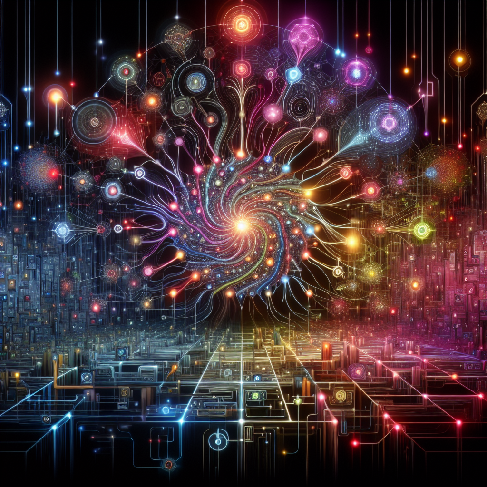
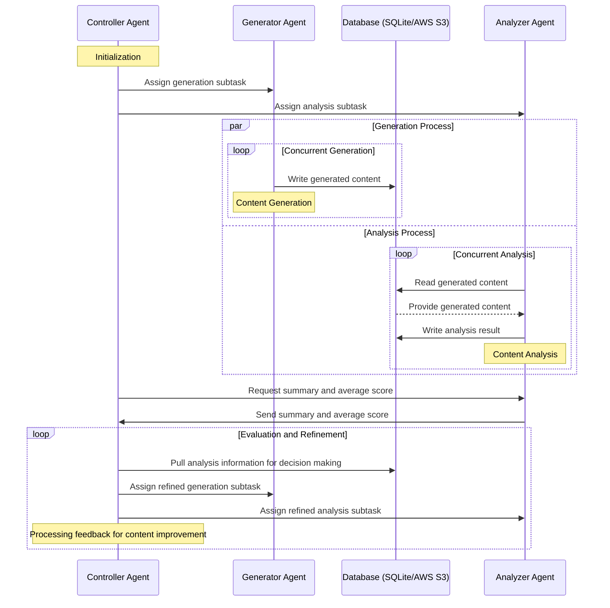

# Orchestrating Harmony: A Hierarchical Swarm of Agents in a Concurrent, Multi-Modal, and Database-Driven Symphony



The implementation of: ``**Orchestrating Harmony: A Hierarchical Swarm of Agents in a Concurrent, Multi-Modal, and Database-Driven Symphony''**. https://medium.com/@arash.mansoori65/harnessing-hierarchical-swarms-a-groundbreaking-approach-to-multi-modal-content-creation-061dbcb698f6

## Description of the Proposed Method
The proposed hierarchical swarm agent system is a novel and sophisticated framework designed for efficient task decomposition, concurrent content generation and analysis, and robust agent interaction through a well-integrated database system. This approach leverages a Controller Agent, a Generator Agent, an Analyzer Agent, and a database to accomplish high-quality, multi-modal content generation tasks—demonstrated here using image generation and analysis to showcase the method's competency.

### Overview:
Our system encapsulates a main Controller Agent (CA) that orchestrates the work by decomposing a composite task into two distinct subtasks aimed at our Generator Agent (GA) and Analyzer Agent (AA), respectively. The GA is entrusted with the responsibility of content generation, following instructions from the CA, while concurrently provisioning the output to our versatile database; this promotes seamless collaboration with the AA. Subsequently, the AA engages in concurrent analysis of the content directly from the database, ensuring simultaneous processing and analytics.

What sets our framework apart is its facilitative support for both sqlite and AWS S3 bucket databases, ensuring flexibility and robustness in the interaction between the GA and AA.

### Concurrent Generation and Analysis:
Emphasizing concurrency, our GA performs content generation tasks in a parallelized manner, ensuring efficiency and optimal use of resources. The generated content is promptly added to the database, which is critical for enabling continuous and immediate access by the AA. Similarly, analysis tasks are executed concurrently by the AA, which reads the content, performs the necessary analysis, and writes the results back to the database.

Through this system, a feedback loop is created where the CA pulls the analysis results, including the average stipulated score, to refine task objectives and guide the GA and AA towards iterative improvements.

### Database-Driven Communication:
The choice of database—whether a lightweight local sqlite setup or a scalable AWS S3 bucket—is pivotal in our design for promoting robust and efficient communication between the GA and AA. By leveraging a centralized storage mechanism, we ensure that the vast data throughput generated during concurrent operations is handled effectively, facilitating real-time updates and access control.

### Application and Adaptability:
While we showcase image generation and analysis, the framework provides a general solution applicable to various domains requiring high-quality multi-modal content generation, such as code generation, audio synthesis, and automated summarization.

Integrate the following Mermaid sequence diagram to illustrate the workflows and concurrent processes inherent in the proposed hierarchical swarm agent system, thereby providing a visual aide to understand the intricate communication and processing steps involved:



In sum, this comprehensive procedural outline emphasizes the novel features of the hierarchical swarm agent system and its competency in fostering a persuasive case for multi-modal generative and analytic applications across diverse fields.

## Installation
Create a virtual environment and activate it:

**Note**: The following commands work for Mac and Linux, use the appropriate commands to create and activate virtual environment for Windows.

```sh
python -m venv .venv
```

```sh
source .venv/bin/activate
```

Upgrade `pip` and install all the necessary requirements as follows.

```sh
pip install --upgrade pip
```

```sh
pip install -r requirements.txt
```

## Environment Variables
Create a .env file and set your ```openai``` API key as well as AWS access key, secret access key, and your defualt region for the AWS S3 bucket.

## Run the Swarm of Agents
Set the appropriate parameters according to your need in ```configs``` directory. Then, run the multi-modal, database-driven swarm of agents as follows.

```sh
python run_swarm_with_db.py
```

## Baseline
Run the following for the baseline generation and analysis, respectively.

```sh
python run_gen_baseline.py
```

```sh
python run_anlys_baseline.py
```

## Remove Resources
To remove all the resources including: agents' ids, database, and data saved locally, run the following command.

```sh
python run_remove_resources.py
```

## Results
The generated images for this research are saved in ```data``` folder. The complete analysis and generated conents can be found in ```images.db```.

## Author
Arash Shahmansoori (arash.mansoori65@gmail.com)

## License
This project is licensed under the terms of the [MIT License](LICENSE)