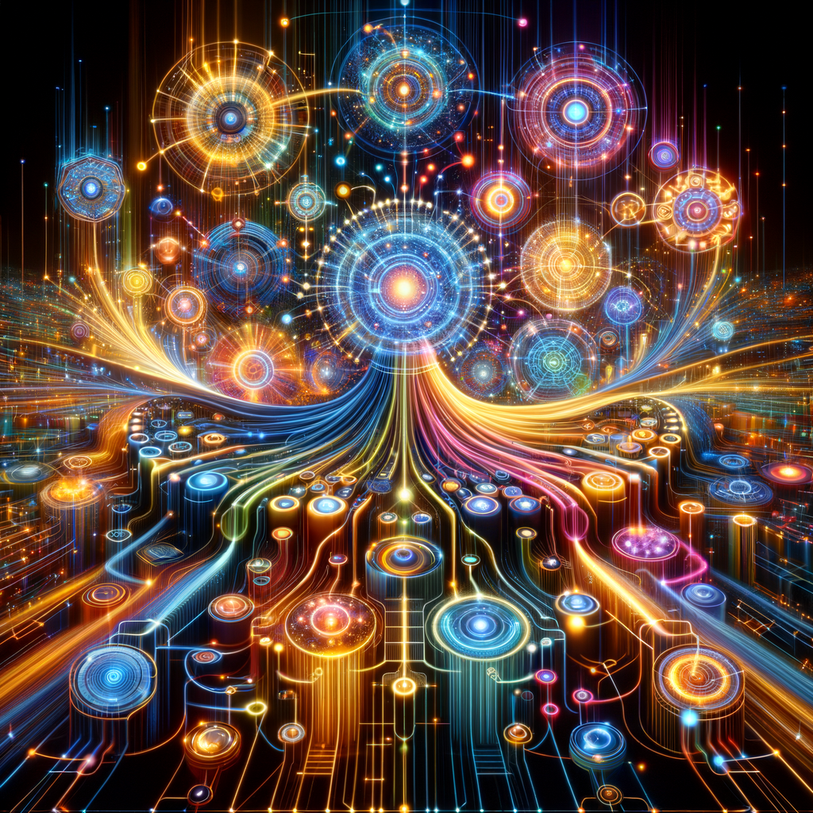
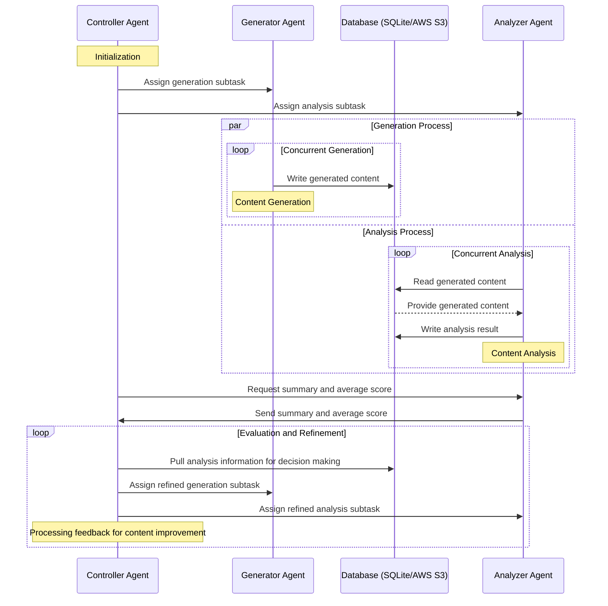

# Orchestrating Harmony: A Hierarchical Swarm of Agents in a Concurrent, Multi-Modal, and Database-Driven Symphony



## Introduction
In the rapidly evolving landscape of artificial intelligence, the exploration of innovative architectures for more dynamic and efficient processing has become paramount. This blog delves into a groundbreaking approach to AI task execution and analysis through the development of a hierarchical swarm of agents. This system comprises a sophisticated network of a controller agent, a generator agent, an analyzer agent, and a comprehensive database support system. At the heart of this innovation lies the seamless decomposition of composite tasks into subtasks, handled concurrently by the generator and analyzer agents, a process that significantly enhances content generation and analysis efficiency.

In this exploration of artificial intelligence's frontier, we transcend beyond the established norms found in current literature[1][2]—which predominantly delve into conversational agents of a singular nature or hierarchical swarms lacking concurrency and multi-modality. Our work emerges as a trailblazing model, pioneering the enhancement of OpenAI's assistants/agents by integrating the power of multi-modality with the dynamism of concurrent generation and analytical processes. This is further augmented by the introduction of a novel database-driven communication strategy between agents, elevating the complexity and efficiency of interactions within and across modalities, setting a new benchmark for AI research and application.

Our methodology introduces a pivotal shift in handling complex tasks by employing a controller agent responsible for the meticulous partition of composite tasks. This ensures targeted and efficient content generation by the generator agent and in-depth analysis by the analyzer agent, all occurring in parallel. What sets this framework apart is not just its concurrency, but its robust support for both SQLite and AWS S3 bucket databases. This dual database compatibility plays a crucial role in facilitating robust and seamless interaction between the generator and analyzer agents, enabling a fluid exchange of generated content and analytical results. 

This architecture not only streamlines the generation and analysis process but also elevates the capabilities of AI in handling multi-modal content, with a keen focus on image generation and analysis. By implementing this hierarchical swarm of agents, we propose a general framework that can significantly improve the quality and accuracy of content generation across various domains, including code generation, audio production, and content summarization.

Key novel aspects of our research include:
- **Concurrency in Generation and Analysis**: Leveraging parallel processes to maximize efficiency in content generation and analysis.
- **Efficient Composite Task Decomposition**: Strategic breakdown of complex tasks into manageable subtasks for precise execution.
- **Robust Database Integration**: Support for both SQLite and AWS S3 bucket databases, ensuring dynamic and efficient data exchange between agents.
- **Efficient Communication Between Agents**: Streamlined interaction among the controller, generator, and analyzer agents, facilitating rapid task execution and refinement.
- **Multi-Generation and Multi-Analysis Capability**: The concurrent processing framework supports diverse content types, demonstrating our system's multi-modal capabilities.
- **Application in Multi-Modal Content Generation**: While emphasizing image generation and analysis, the proposed method holds the potential for widespread applications across various content types.

Through this blog, we aim to showcase the potential of our hierarchical swarm of agent-based framework in revolutionizing AI's role in efficient and high-quality multi-modal content generation, setting a new benchmark for future developments in the field.

## Proposed Method
In devising a methodological approach to steer a hierarchical swarm of intelligent agents, including a Controller Agent, Generator Agent, and Analyzer Agent, our focus has been on harmonizing the intricate dance of content generation and analysis. This synergy is directed towards the creation, scrutiny, and enhancement of multimodal content, notably, images—with a keen eye on achieving pinnacle content quality. The essence of this methodology is underpinned by concurrent operations and the nimble use of databases, promoting a robust interplay between generation and analysis that echoes the variability and complexity akin to human cognitive processes.

### Hierarchical Agent Workflow
Visualized through the ensuing diagram lays bare the orchestrated concurrency and inter-agent communication. It underscores the concurrent content generation by the Generator Agent and its subsequent analysis by the Analyzer Agent. Furthermore, it highlights the seamless database interactions, accommodating both SQLite and AWS S3 bucket, ensuring a resilient exchange of information.



### Description of the Proposed Algorithm
1. **Initialization:**
   The Controller Agent embarks on this journey by meticulously dissecting a composite task into digestible sub-tasks, geared for the Generator and Analyzer Agents. This initiatory step is pivotal, setting the stage for a choreographed performance of content generation and analysis. 

2. **Concurrent Generation and Analysis:**
   Intricately, the Generator Agent commences the ballet of content creation, with each piece of content elegantly penned to the database—a nexus for SQLite and AWS S3 bucket. Parallel to this, the Analyzer Agent, in anticipation, seizes the freshly minted content from the database. With analytical rigor, it embarks on a deep dive into the fabric of the generated content, unearthing insights and quantifying quality.

3. **Data Storage and Communication:**
   This methodical process is underpinned by the database's role as a conclave for concurrent interactions, fostering a dialogue between creation and critique that is both resilient and nuanced. The dual compatibility with SQLite and AWS S3 enriches this dialogue, offering a dexterity to adapt to various operational needs.

4. **Feedback Loop:**
   With the analytical gaze of the Analyzer Agent now translated into actionable insights and synthesized into an average stipulated score, a feedback loop emerges. The Controller Agent, armed with these insights, fine-tunes the ensuing sub-tasks, heralding a cycle of perpetual refinement. 

5. **Iterative Improvement:**
   The narrative progresses with the Controller Agent adjudicating the merits of content—ushering ones necessitating augmentation back into the crucible for refinement. This cyclical odyssey of generation, analysis, and enhancement forges ahead with an eye towards the zenith of content quality.

### Use of Databases
The tactical deployment of SQLite for its nimbleness and AWS S3 for its expansiveness underscores our architectural philosophy—a testament to our commitment to versatility and robust agent communication.

### Multi-generation and Multi-analysis Capabilities
Our approach transcends the confines of single-mode content generation. By fostering a milieu where concurrent generation and analysis thrive, we unveil a paradigm capable of multi-generation and multi-analysis. While our narrative is anchored in the realm of image content, the principles espoused here hold the promise of universality—paving the way for innovation across domains like code orchestration, sonic landscapes, and textual tapestries.

Thus, ensconced within this methodological framework is a vision that marries the artistry of generation with the discernment of analysis, facilitated by a symphony of intelligent agents. It is a canvas where the brushstrokes of innovation meet the critical eye of quality—ushering in a new epoch of multimodal content generation.

## Python Code for the Entire Process
Below we present the gateway to initiating our proposed framework's swarm of multi-modal concurrent generative-analytic agents. For an extensive explanation of each module's implementation within the provided code snippet, we direct you to the dedicated GitHub repository link in [3].

```python
import json
import os
import threading

from agent_funcs import img_analyzer, img_generator
from agent_loop import agent_loop, agent_loop_anlys_with_func, agent_loop_gen_with_func
from agents_build import agent_builder
from communication import ThreadCommunication, get_all_items
from configs import parse_kwargs_db
from prompts import (
    anlys_image_user_prompt,
    cont_image_user_prompt,
    gen_image_user_prompt,
)

# from remove_resources import remove_local_data
from shared_components import create_client


def main():
    comm = ThreadCommunication()

    params = parse_kwargs_db()

    client = create_client()

    agents_ids_dir_name = "agents_build/ids/"
    agents_ids_file_name = "agent_ids.json"

    file_path = os.path.join(agents_ids_dir_name, agents_ids_file_name)

    feedback = "# Feedback on Generations:\n"  # Initialize feedback from previous round

    for r in range(params["n_round"]):
        # Make directories to save generation and analysis outputs
        try:
            os.makedirs(agents_ids_dir_name)
            os.makedirs(params["kwargs_db"]["local_file_path_image"])
            if params["kwargs_name"] == "kwargs_s3":
                os.makedirs(params["kwargs_db"]["local_file_path_text"])
        except FileExistsError:
            # directory already exists
            pass

        agents_ids_json = []

        if os.path.exists(file_path):
            with open(file_path, "r") as f:
                agents_ids = json.load(f)

                cont_agent_id = agents_ids[0]["controller"]
                gen_agent_id = agents_ids[1]["generator"]
                anlys_agent_id = agents_ids[2]["analyzer"]

        else:
            _, agent_cont = agent_builder(
                client,
                params["sys_prompt_cont"],
                params["num_cont_agent"],
                **params["params_cont"],
            )

            cont_agent_id = agent_cont.id

            _, agent_gen = agent_builder(
                client,
                params["sys_prompt_gen"],
                params["num_gen_agent"],
                **params["params_gen"],
            )

            gen_agent_id = agent_gen.id

            _, agent_anlys = agent_builder(
                client,
                params["sys_prompt_anlys"],
                params["num_anlys_agent"],
                **params["params_anlys"],
            )

            anlys_agent_id = agent_anlys.id

            with open(file_path, "w") as file:
                agents_ids_json.append({"controller": cont_agent_id})
                agents_ids_json.append({"generator": gen_agent_id})
                agents_ids_json.append({"analyzer": anlys_agent_id})

                json.dump(agents_ids_json, file)

        generator_fn = img_generator
        analyzer_fn = img_analyzer

        subject = params["subject"]

        msg_cont = cont_image_user_prompt(subject, feedback)

        # Create threads
        controller_thread = threading.Thread(
            target=params["kwargs_db"]["controller"],
            args=(
                client,
                cont_agent_id,
                params["subject"],
                msg_cont,
                params["thread_count_gen"],
                comm,
                gen_image_user_prompt,
                agent_loop,
            ),
            name="Communication-Thread-Controller",
        )

        generator_threads = [
            threading.Thread(
                target=params["kwargs_db"]["generator"],
                args=(
                    client,
                    i + 1 + (r) * params["thread_count_gen"],
                    gen_agent_id,
                    comm,
                    params["gen_time_out"],
                    generator_fn,
                    agent_loop_gen_with_func,
                ),
                kwargs=params["kwargs_db"],
                name=f"Thread-Generator-{i}",
            )
            for i in range(params["thread_count_gen"])
        ]

        analyzer_threads = [
            threading.Thread(
                target=params["kwargs_db"]["analyzer"],
                args=(
                    client,
                    i + 1 + (r) * params["thread_count_gen"],
                    anlys_agent_id,
                    params["subject"],
                    comm,
                    anlys_image_user_prompt,
                    analyzer_fn,
                    agent_loop_anlys_with_func,
                ),
                kwargs=params["kwargs_db"],
                name=f"Thread-Analyzer-{i}",
            )
            for i in range(params["thread_count_anlys"])
        ]

        # Start the controller thread & Wait for thread to finish dispatching
        controller_thread.start()
        controller_thread.join()

        print("Dispatching completed.")

        # Start threads & Wait for threads to finish generation
        for generator_thread in generator_threads:
            generator_thread.start()

        for generator_thread in generator_threads:
            generator_thread.join()

        print("Generation completed.")

        # Start threads & Wait for threads to finish analysis
        for analyzer_thread in analyzer_threads:
            analyzer_thread.start()

        for analyzer_thread in analyzer_threads:
            analyzer_thread.join()

        print("Analysis completed.")

        # # Remove local data after each round
        # if params["kwargs_name"] == "kwargs_s3":
        #     remove_local_data("data_s3")
        # else:
        #     remove_local_data("data")

        assesments = get_all_items(comm.queues["anlys_to_cont"])

        feedback = f"""
                    {feedback}

                    ## Feedback
                    {assesments}

                    ## Round
                    {r}
                    """


if __name__ == "__main__":
    main()
```

Below is an elucidation segmenting the holistic process instantiated by the Python script, emphasizing the concurrent generation and analysis of multimodal content within an AI swarm architecture. This explanation accentuates the core functionalities of generator and analyzer agents, the utilization of both SQLite and AWS S3 databases for robust communication, and the orchestration led by a controller agent. 

### 1. **Imports and Basic Setup:**
- Required libraries such as `json`, `os`, and `threading` are imported to facilitate file operations, concurrency through multi-threading, and data serialization.
- Specific modules including `img_analyzer`, `img_generator`, and others are imported. These modules contain tailored functions that execute distinct tasks: image generation, image analysis, agent creation, and communication.
- The `create_client()` function initializes a client for interacting with services (in this instance, likely to communicate with an AI or cloud service).

### 2. **The `main()` Function – Initialization:**
- Initiates `ThreadCommunication()` for enabling threads to communicate efficiently, signifying the start of the hierarchical swarm system.
- Parses database configurations, accounting for the dual support of SQLite and AWS S3 bucket databases, which are pivotal in enabling persistent, yet flexible storage options.
- Establishes agent directories and files to manage identities of controller, generator, and analyzer agents, ensuring seamless orchestration and data logging.

### 3. **Agent Creation and Setup:**
- Checks for the existence of agent ID files and either retrieves or builds new agents (`controller`, `generator`, `analyzer`) using the `agent_builder()` function, which hinges on the `create_client()` function for creating an Operational Intelligence (OI) client specific to each agent.
- This part underpins the system's modularity, allowing for dynamic agent replacement or expansion.

### 4. **Thread-based Concurrent Operations:**
- Concurrent operations are managed through threading, a choice that lends the system its concurrent generative and analytic capabilities.
- **Controller Thread**: Orchestrates the overall process, directing subtasks to both generator and analyzer threads. This thread acts as the conductor in the symphony of AI agents.
- **Generator Threads**: Dedicated to producing content based on assigned tasks. Their operation is concurrent, bolstered by threading, underscoring the system's efficiency and scalability.
- **Analyzer Threads**: Perform concurrent analysis of the generated content. This setup highlights the robust interaction between generated content and analytical scrutiny, made resilient through database usage.

### 5. **Robust Database Communication:**
- The seamless storage and retrieval of generated content and analysis results are facilitated by the databases. The design permits the use of SQLite for more localized, lightweight applications, or AWS S3 for cloud-based, scalable storage needs. This dual capability ensures a versatile, robust backend for agent communication.

### 6. **Iterative Process and Feedback Loop:**
- The iterative nature of this process, underscored by the for loop `for r in range(params["n_round"])`, allows for continuous refinement of generated content based on feedback from the analysis phase.
- Assessments retrieved from the analysis phase inform subsequent rounds of generation, embodying an adaptive system capable of self-improvement.

### 7. **Concurrency Management and Thread Synchronization:**
- `join()` methods ensure orderliness in the concurrent execution, dictating that tasks are completed in a synchronized manner before moving to the next phase, thereby avoiding any potential race conditions or data inconsistencies.

### 8. **Finally:**
- Post-analysis, feedback is compiled and used to inform the next iteration of generation tasks, indicating an ongoing cycle of generation, analysis, and refinement aimed at optimizing the quality of the generated content.
- This systematic approach encapsulates the reinforcing, cyclic nature between content generation and analysis, exemplified through concrete threading structures and database interactions.

### Execution Inference:
- Upon invocation (`if __name__ == "__main__": main()`), the script launches into the aforementioned sequence, initiating a sophisticated dance of AI agents geared toward the elevated generation and analysis of content. The architecture exudes a nuanced blend of concurrency and robustness, promising an architecture adaptable across myriad content generation applications.

## Results

### Setup
The hierarchical swarm of agents implemented in the proposed system integrates cutting-edge language and vision models to accomplish the task of concurrent content generation and analysis. The "gpt-4-turbo-preview" model serves as the backbone for the main linguistic operations within all agents. This inclusion facilitates sophisticated decision-making and natural language comprehension, paving the way for a nuanced task breakdown and effective communication. Moreover, the generator agent boasts the "dall-e-3" model's integration, enabling it to produce visually compelling content. In parallel, the analyzer agent harnesses "gpt-4-vision-preview" to evaluate the generated images critically, ensuring adherence to preset standards and quality benchmarks.

### Baseline Comparison 
The baseline for our study involves using the "dall-e-3" model in isolation for text-to-image generation tasks. Although capable, this baseline process lacks iterative refinement and does not capitalize on concurrent generation and analysis, leading to lower adaptability and potentially suboptimal output quality in terms of meeting stipulated requirements.

### Effective Decomposition and Concurrency
Our results demonstrate a marked improvement in the generation of content specifically tailored to achieve the highest average stipulated score, signifying a superior alignment with task requirements. The concurrency in the generation and analysis processes allowed for the simultaneous production and assessment of content, underpinning a rapid iterative refinement loop. This loop fostered a more precise and quality-centric development of outputs, with each cycle contributing to an incremental enhancement.

### Database-Enabled Robust Interaction
By leveraging a robust database structure, encompassing both SQLite and AWS S3 buckets, the system facilitated a seamless interaction between the generator and analyzer agents. This interaction was critical in achieving an efficient search for the highest-quality content, thus substantiating the database's role in enhancing the agents’ collaboration.

### Multi-Modal Capabilities and Iterative Refinement
The application of this method to image generation and analysis vividly illustrates the system's multi-modal capabilities. Through iterative refinement, the proposed model consistently outperformed the baseline in generating images that better satisfied the average stipulated requirements. This approach exemplified the potential of our method as a fundamental building block for future research endeavors toward crafting swarms of multi-modal agents, crucial for achieving high-quality multi-modal content generation across diverse applications.

### Path to Artificial General Intelligence
The enhancement in content alignment, facilitated by concurrent content generation and analysis, together with robust agent interaction mediated by the database system, underscores the importance of this work in the broader AI landscape. These results not only fulfill the immediate goals of a more capable multi-modal generation framework but also signify a step towards the realization of artificial general intelligence, built upon the robust foundation of a hierarchically organized swarm of multi-modal agents.


## Conclusion and Final Thoughts
In sum, our innovative hierarchical swarm of agents epitomizes the synergy between efficient task decomposition and concurrent processing in artificial intelligence systems. At the cornerstone of this architecture lies a robust controller agent, skillfully orchestrating the generation and analysis of content by delegating responsibilities and managing the loop of feedback and refinement. 

The generator and analyzer agents operate in unison yet independently, demonstrating a robust parallelization of content creation and assessment. This concurrency not only streamlines the workflow but also dramatically accelerates the iterative process of achieving high-quality output, which is evidenced by the progressively optimized average stipulated scores. Both the SQLite and AWS S3 bucket integration showcase our system’s versatility and adaptability, ensuring a seamless and resilient exchange of data that complements the concurrent analytical operation.

The work presented provides a blueprint for robust interaction within a systematic framework capable of handling complex composite tasks. As the agents work concurrently, this allows multiple generations and analyses to occur simultaneously, which is a testament to the multi-modal capabilities that can be leveraged across a spectrum of domains— from code generation to audio processing and content summarization.

The efficacious communication channels between agents, facilitated by a supportive database infrastructure, not only ensure a continuous and dynamic data flow but also contribute to the robustness and efficiency of the system. Our methodology lays a versatile foundation for future exploration in multi-modal content generation and analysis, pushing the envelope of what is possible within automated systems and intelligent task handling.

As we conclude, it is important to emphasize the broader implications of this research. Our hierarchical swarm of agent-based model not only provides a significant contribution to the field of image generation and analysis but also extends its potential to other multi-modal applications. This versatility attests to the framework's capacity for adaptation and scalability, heralding a new era of content generation and analysis systems that are not only efficient and concurrent but also resilient and capable of handling diverse and complex tasks.


## References
[1]: Q. Wu, G. Bansal, J. Zhang, Y. Wu, B. Li, E. Zhu, L. Jiang, X. Zhang, S. Zhang, J. Liu, A.H. Awadallah, R.W. White,  D. Burger, and C. Wang, AutoGen: Enabling Next-Gen LLM Applications via Multi-Agent Conversation, arXiv preprint arXiv: 2308.08155, 2023. 

[2]: D. Shapiro, Hierarchical Autonomous Agent Swarm (HAAS), 
https://github.com/daveshap/OpenAI_Agent_Swarm.git, 2023.

[3]: A. Shahmansoori, Orchestrating Harmony: A Hierarchical Swarm of Agents in a Concurrent, Multi-Modal, and Database-Driven Symphony, https://github.com/arash-shahmansoori/multi_modal_db_driven_agents_swarm.git, 2024.
